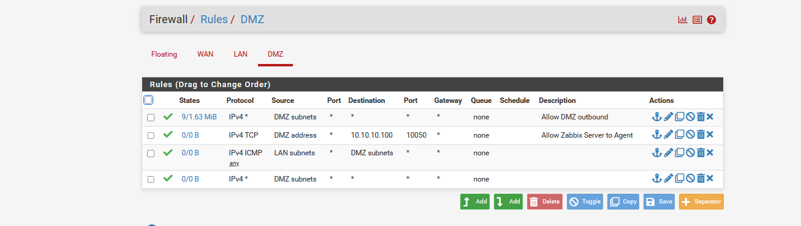
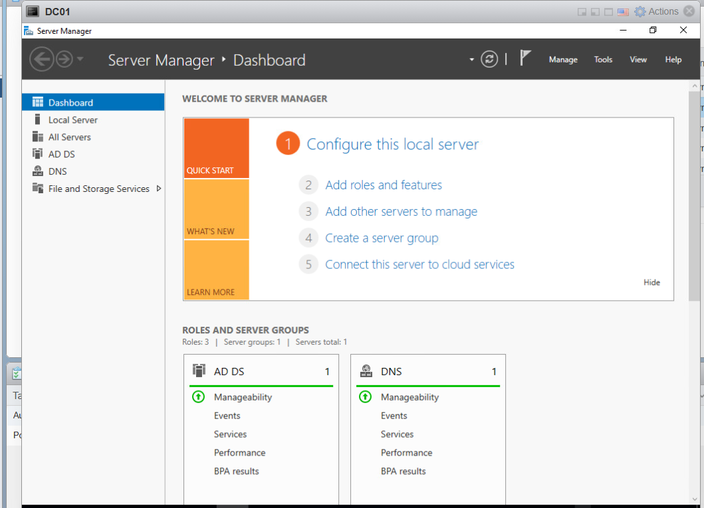
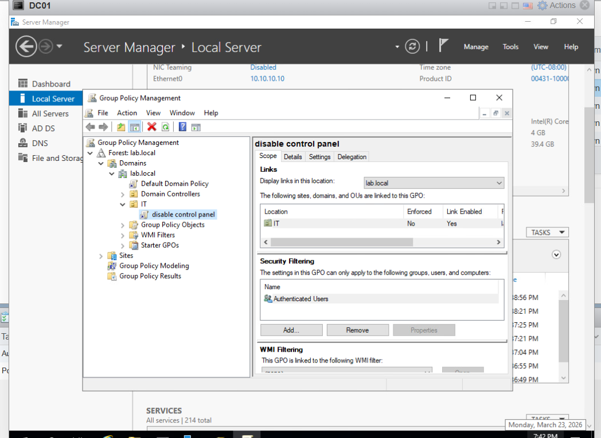
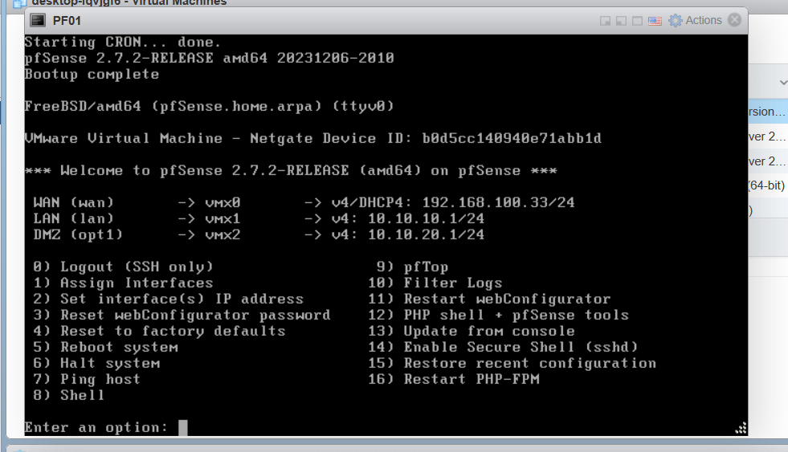
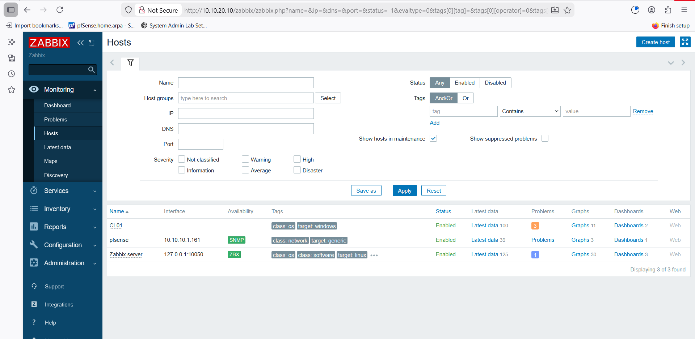
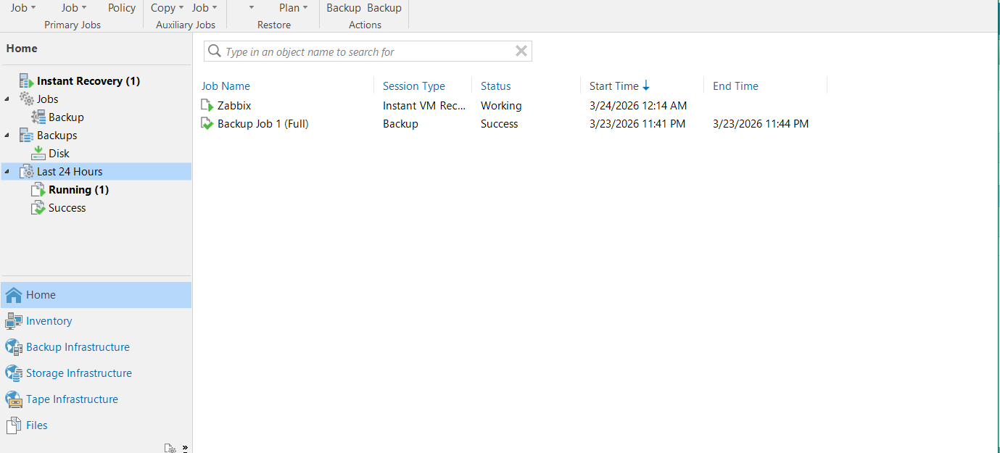

# Enterprise-Infrastructure-Homelab
Enterprise infrastructure lab using VMware ESXi, Active Directory, pfSense firewall, Zabbix monitoring, and Veeam backup
## 📌 Overview
This project simulates a full enterprise IT infrastructure environment including virtualization, identity management, network security, monitoring, and backup solutions.

Built using VMware ESXi to replicate real-world production environments.

---

## 🧰 Technologies Used
- VMware ESXi
- Windows Server 2019 (AD DS, DNS, DHCP, GPO)
- pfSense Firewall
- Zabbix Monitoring
- Veeam Backup & Replication
- Windows Client
- Linux Server

---

## 🖥️ Virtual Infrastructure
- PF01 → pfSense Firewall  
- DC01 → Domain Controller  
- DC02 → Secondary Server  
- CL01 → Windows Client  
- Zabbix → Monitoring Server  

---

## 🌐 Network Design
- WAN → External network  
- LAN → Internal network  
- DMZ → Isolated network  

### Features:
- Network segmentation (LAN / DMZ)
- Controlled communication between networks
- Firewall rules implementation

---

## 🔐 Firewall (pfSense)
- Configured WAN, LAN, DMZ interfaces  
- Created firewall rules for traffic control  
- Enabled secure communication  
- Allowed monitoring traffic (Zabbix Agent)

---

## 🏢 Active Directory
- Domain: lab.local  
- Created OUs, Users, Groups  
- Applied Group Policy  

### Example:
- Disabled Control Panel using GPO  

---

## 📡 Monitoring (Zabbix)
- Deployed Zabbix server  
- Added multiple hosts (Windows / pfSense)  
- Configured SNMP and Agent monitoring  
- Real-time monitoring and alerts  

---

## 💾 Backup & Disaster Recovery (Veeam)

- Configured Veeam Backup & Replication  
- Created full backup jobs for virtual machines  
- Integrated with VMware ESXi datastore  
- Successfully completed backup jobs  

### 🔁 Recovery Testing:
- Performed Instant VM Recovery  
- Verified backup integrity  
- Ensured disaster recovery readiness  

---

## 📸 Screenshots

### VMware ESXi

### Active Directory

### Group Policy

### pfSense Firewall

### Zabbix Monitoring

### Veeam Backup

---

## 👨‍💻 Author
Ahmed Ashraf  
System Administrator | Infrastructure Engineer
